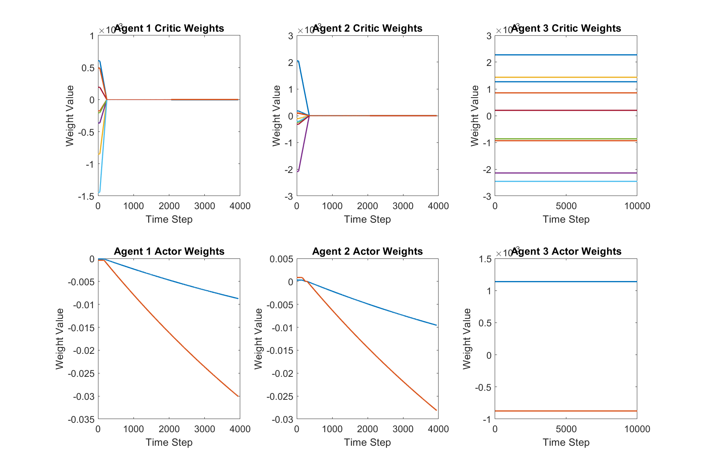
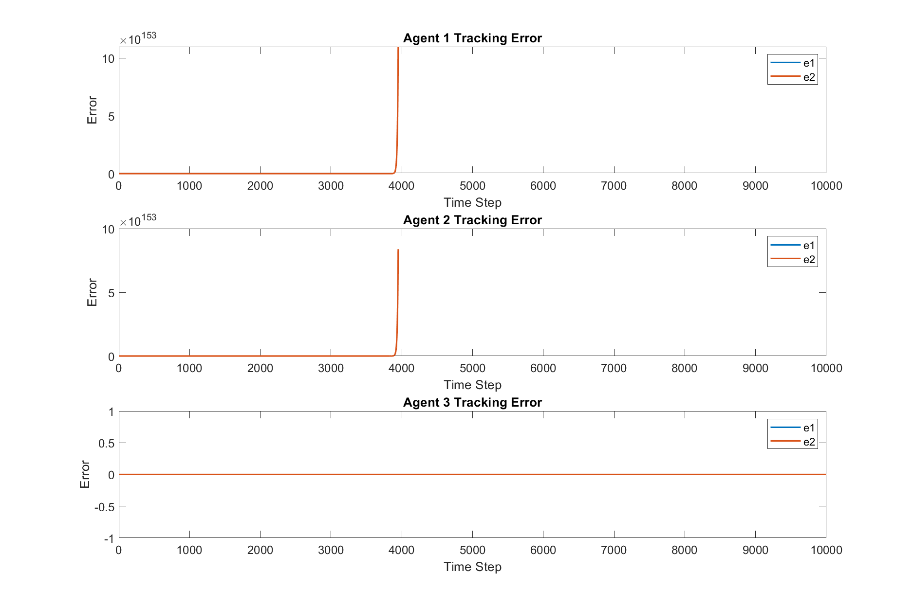
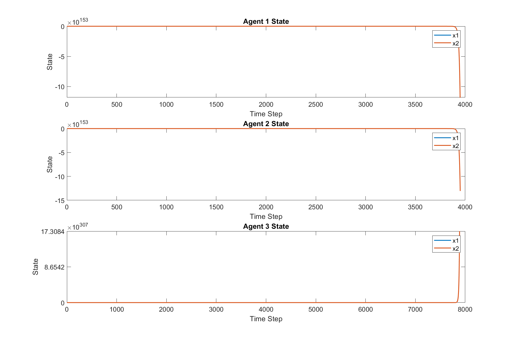
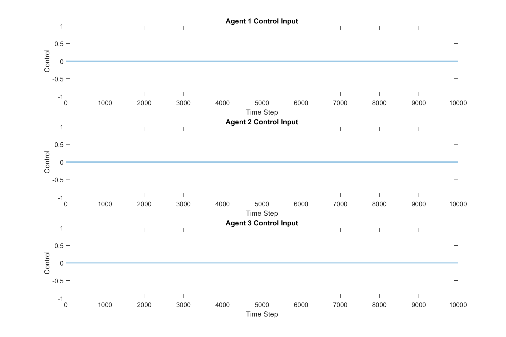

# Multi-Agent Reinforcement Learning Algorithm

This project implements a value iteration-based multi-agent reinforcement learning algorithm to solve the Nash equilibrium problem in multi-agent systems.

## Algorithm Overview

The algorithm is based on the following key components:

1. **Value Iteration**: Used to update Q-values and optimal policies for each agent.
2. **Actor-Critic Network**: Approximates the value function and policy function.
3. **Gradient Clipping**: Prevents gradient explosion problems.
4. **Adaptive Learning Rate**: Decays over time to ensure algorithm convergence.

## Main Functions

- `main_simulation()`: Main simulation loop
- `value_iteration()`: Performs value iteration updates
- `compute_Mi()`: Calculates the Mi matrix for each agent
- `actor_critic_network()`: Implements the Actor-Critic network
- `tracking_error()`: Computes tracking errors
- `system_dynamics()`: Simulates system dynamics

## Simulation Results

Here are some key results from running the algorithm:

### 1. Critic and Actor Weight Changes

This graph shows how the weights of the Critic and Actor networks change over time.

### 2. Tracking Error Dynamics

This graph displays the tracking errors for each agent over time.

### 3. Agent State Changes

This graph demonstrates how the state of each agent changes over time.

### 4. Control Input Changes

This graph shows how the control inputs for each agent change over time.

## Running Instructions

1. Ensure your MATLAB environment is properly configured.
2. Run the `main_simulation()` function to start the simulation.
3. Results will be automatically saved in the `result` directory.

## Notes

- Algorithm performance may be affected by initial parameter settings.
- For large-scale systems, adjustment of learning rates and iteration numbers may be necessary.

## Future Work

- Implement more complex reward functions
- Explore other types of Actor-Critic architectures
- Test algorithm performance on real physical systems

